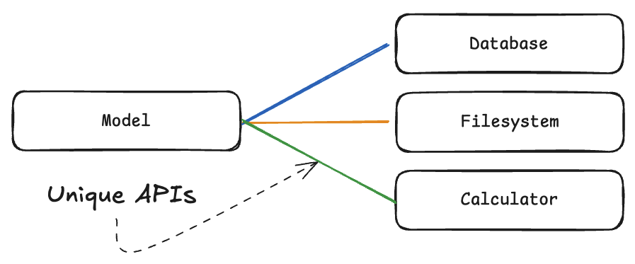
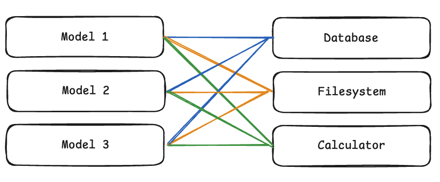
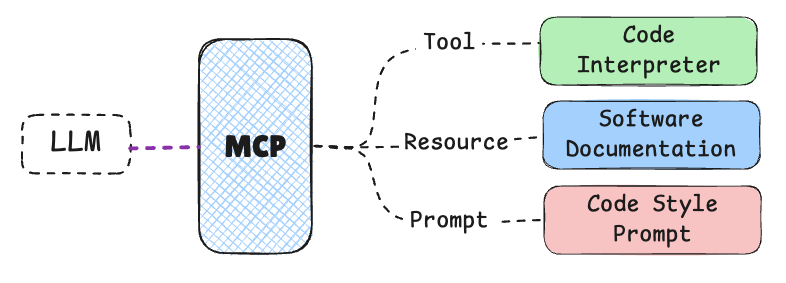
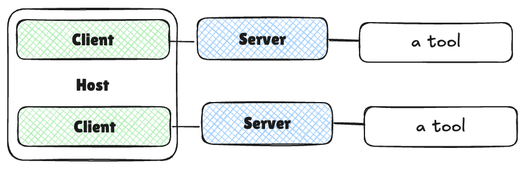
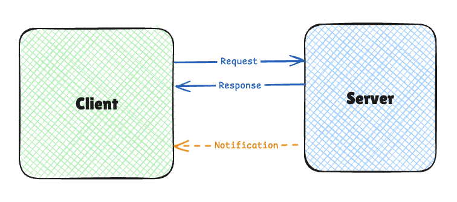
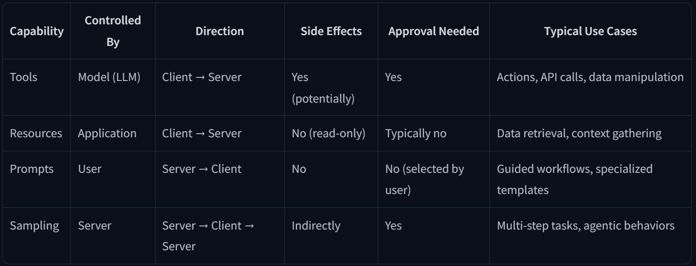
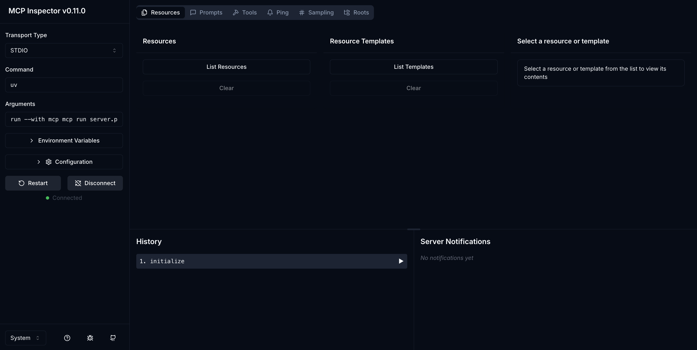
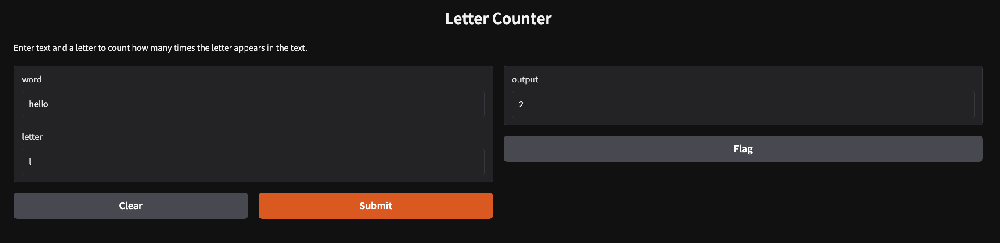

# [Introduction to Model Context Protocol (MCP)](https://huggingface.co/learn/mcp-course/unit1/introduction#introduction-to-model-context-protocol-mcp)
MCP isminde de belirtildiği üzere bir protokoldür. Bu protokol sayesinde AI modelleri harici veriye, tools (araçlara), environments (ortamlara) erişim sağlayabilir.
# [Key Concepts and Terminology](https://huggingface.co/learn/mcp-course/unit1/key-concepts#key-concepts-and-terminology)
MCP, AI ile çalışan uygulamalar için USB-C benzeri bir yapıdır. USB-C çeşitli harici aygıtları bilgisayara bağlamayı sağlayan standartlaştırılmış fiziksel ve mantıksal bir arayüz sağlar. MCP yapısı da AI modelleri için aynı şeyi yapar. Bu standartlaştırma aşağıdaki yetenekleri kazandırır:
- Kullanıcılara AI uygulamalarında daha basit ve tutarlı deneyim sağlar.
- Bu sistemleri kuran geliştiricilere büyüyen araç ve veri kaynağı ekosistemine kolay entegrasyon sağlar.
- Tek bir MCP uyumlu sistem birden fazla AI uygulaması ile çalışabilir.
- Büyüyen ekosistemde herkesin kendi sistemini oluşturması gerekmez, bunun yerine herkes üzerinde anlaştığı bu protokolü kullanır. 
### [The Integration Problem](https://huggingface.co/learn/mcp-course/unit1/key-concepts#the-integration-problem)
M farklı yapay zeka uygulamasının N farklı harici kaynağa bağlanması zor bir iştir ve bu **M×N Integration Problem**  olarak açıklanır.
### [Without MCP (M×N Problem)](https://huggingface.co/learn/mcp-course/unit1/key-concepts#without-mcp-mn-problem)
MCP olmadığı durumda geliştiricilerin M×N adet özel entegrasyon oluşturması gerekir.
  
MCP bu iş yükünü (sistemin kurulması/sistemin bakımı ve büyümesi) ortadan kaldırır. Birden fazla bu tarz araç bir noktadan sonra yönetilemez hale gelir. Örneğin 3 AI uygulaması var (ChatGPT, Claude, Gemini) ve 4 araç var (Veritabanı, API, Dosya sistemi, Hesap makinesi). Her AI'ın her araçla konuşabilmesi için 4×3 kere özel kod yazılması gerekir. Toplamda 12 entegrasyon gereklidir. Aşağıdaki gibi:
  
### [With MCP (M+N Solution)](https://huggingface.co/learn/mcp-course/unit1/key-concepts#with-mcp-mn-solution)
MCP ile bu zorluk M+N problemine dönüşür. Her AI uygulaması sadece MCP protokolünü anlamayı öğrenir (3 entegrasyon). Her araç sadece MCP protokolünü konuşmayı öğrenir (4 entegrasyon). Toplam 7 entegrasyon yeterlidir. Eğer yeni bir AI modeli entegre etmek gerekse, MCP olmadan modeli tüm araçlara entegre etmek gerekirdi. MCP ile sadece modelin MCP'yi anlaması yeterlidir. Otomatik olarak tüm MCP uyumlu araçlara erişim sağlanır. MCP bu noktada ortak dil görevi görür.
## [Core MCP Terminology](https://huggingface.co/learn/mcp-course/unit1/key-concepts#core-mcp-terminology)
MCP bir standartlaştırma getirdiği için bu sistemin kurulumunun belirlenmiş bir standart doğrultusunda olması gerekir.
### [Components](https://huggingface.co/learn/mcp-course/unit1/key-concepts#components)
MCP içerisinde HTTP'de olduğu gibi client (istemci) - server (sunucu) yapısı vardır.
  
- **Host**: Kullanıcının direkt olarak etkileşimde bulunduğu, kullanıcıya yönelik AI uygulamasıdır. Bu yapıya örnekler:  [Anthropic Claude Desktop](https://claude.ai/download), [Cursor](https://www.cursor.com/en) (gibi yapay zeka destekli IDE'ler), Hugging Face Python SDK ve [LangChain](https://www.langchain.com/) veya [smolagents](https://github.com/huggingface/smolagents) gibi kütüphaneler ile oluşturulmuş özel uygulamalar. Bu yöntemler ile kullanıcı isteği yönetilir. 
- **Client**: Host içindeki bir bileşendir ve MCP Server iletişimi yönetir. Her Client sadece 1 Server'a bağlanır. Host tarafından gelen talimatları MCP protokolüne çevirir. Server'dan gelenleri ise Host'a iletir. Köprü görevi görür.
- **Server**: Dış dünyadan gelen, belirli yetenekleri sunan programlardır. Örnek olarak: Veritabanı Server'ı, Dosya Server'ı, API Server'ı. AI uygulamasının ihtiyaç duyduğu ek özellikleri sunan “dış” servistir.

	Not: Bazı kaynaklarda Host ve Client birbiri yerine kullanılabilmekte. Host, kullanıcı etkileşimini sağlayan bileşen. Client, spesifik MCP Server ile iletişimi yöneten bileşendir.
### [Capabilities](https://huggingface.co/learn/mcp-course/unit1/key-concepts#capabilities)
MCP'ler herhangi bir yazılım hizmetine bağlanabilir. Buna ek olarak çoğu AI uygulamasının kullandığı bazı ortak yetenekleri de bünyesinde barındırır.
- **Tools**: AI modelinin eylem gerçekleştirebilmesini sağlayan çalıştırılıp yürütülebilir fonksiyonlardır. Örnek olarak hava durumu uygulaması için belirli lokasyondaki hava durumunu döndüren bir fonksiyon.  

- **Resources**: Önemli bir işlem gerektirmeyen, konu hakkında bağlam sağlayan veri kaynakları. Bir araştırmacı için bilimsel makaleler olabilir.  

- **Prompts**: Önceden hazırlanmış **metin şablonları veya akışlar**. Kullanıcı, AI ve Tools arası etkileşimi sağlar. Örneğin: "Bu metni özetle" şablonu.  

- **Sampling**: **Server tarafının**, Client/Host'a LLM çağrısı yaptırması. Bu sistem tekrarlı işlemler olarak gerçekleşir. Yani model kendi çıktısını değerlendirip yeni kararlar alır. Yazılı içerik üreten bir uygulama oluşturduğu yazıyı düzenleyebilir.  

  
Yukarıdaki diyagrama göre:
Tool -> Code Interpreter isminde LLM'in yazdığı kodları çalıştırabilen bir araç.  

Resource -> Documentation isminde uygulamanın dokümantasyonunu içeren kaynak.  

Prompt -> Code Style isminde LLM'in kod üretmesine rehberlik eden bir istem.  

Sampling -> Code Review isminde LLM'in kodu inceleyip geliştirmeye yönelik kararlar almasını sağlayan yapı.  

# [Architectural Components of MCP](https://huggingface.co/learn/mcp-course/unit1/architectural-components#architectural-components-of-mcp)
## [Host, Client, and Server](https://huggingface.co/learn/mcp-course/unit1/architectural-components#host-client-and-server)
Bu bölümde Host, Client ve Server yapıları detaylı şekilde açıklanacak. Bu kısımda yazılanlar yukarıda yazdıklarımdan çok farklı değil, bundan dolayı not alınacak bir kısım göremedim.
  
## [Communication Flow](https://huggingface.co/learn/mcp-course/unit1/architectural-components#communication-flow)
MCP iş akışında bu bileşenlerin yaptıkları:  

1- **User Interaction**: Kullanıcı Host tarafına bir istek gönderir.  

2- **Host Processing**: Host, kullanıcı girdisini alır ve LLM ile isteği anlayıp Tool kullanımı gerekli mi, gerekiyorsa hangisi gerekli sorusuna cevap verir.  

3- **Client Connection**: Host kendi içeriğindeki Client bileşeninin uygun Server(s) ile bağlantı yapmasını sağlar.  

4- **Capability Discovery**: Client, Server'a hangi yetenekleri sunduğunu öğrenmeye yönelik sorgu gönderir.  

5- **Capability Invocation**: Kullanıcı ihtiyacına yönelik LLM gerekli yetenekleri belirler. Host tarafından Client'a bu yetenekleri (fonksiyonları) Server'dan çağırması söylenir.  

6- **Server Execution**: Server talep edileni yapar ve sonucu Client tarafına iletir.  

7- **Result Integration**: Client, sonuçları Host tarafına gönderir. Host bunları LLM bağlamı içerisine ekler veya isterse doğrudan kullanıcıya sunar.  

 Not: Bu modüler yapı sayesinde **tek** Host **birden fazla** Server'a bağlanabilir. Host tarafında değişiklik gerekmeden yeni Server bağlantıları eklenebilir.  
 
# [Quiz 1: MCP Fundamentals](https://huggingface.co/learn/mcp-course/unit1/quiz1#quiz-1-mcp-fundamentals)

# [The Communication Protocol](https://huggingface.co/learn/mcp-course/unit1/communication-protocol)
MCP ile Client ve Server tutarlı ve öngörülebilir bir şekilde mesaj alışverişinde bulunur. Bu bölümde MCP'nin yapısı ve bilgi taşıma mekanizması anlatılmaktadır.
## [JSON-RPC: The Foundation](https://huggingface.co/learn/mcp-course/unit1/communication-protocol#json-rpc-the-foundation)
MCP içinde Client ve Server arasındaki tüm iletişim [JSON-RPC 2.0](Sözlük/JSON-RPC_2.0.md) ile mümkün olmaktadır. [JSON-RPC 2.0](Sözlük/JSON-RPC_2.0.md) mesajları JSON formatında [encode](Sözlük/encode.md) (kodlanır, coding değil) edilir. Bu yapının faydaları:
- Geliştirici rahatlıkla okuyup hatayı çözebilir.
- Dilden bağımsız çalışır.
- İyi kurulmuş, net özellikleri olan ve yaygın bir formattır.
  
Protokol 3 tür mesaj tanımlar:
### [1. Requests](https://huggingface.co/learn/mcp-course/unit1/communication-protocol#1-requests)
Yönü Client->Server olur. Bir işlem başlatma talebidir. Bu mesaj içerisinde id (Benzersiz tanımlayıcı), method (Çağrılacak yöntem adı (tools/call)), params (Metoda giren parametreler (örn: `"location": "San Francisco"`)) bulunur. Örnek:
```JSON
{
  "jsonrpc": "2.0",
  "id": 1,
  "method": "tools/call",
  "params": {
    "name": "weather",
    "arguments": {
      "location": "San Francisco"
    }
  }
}
```
### [2. Responses](https://huggingface.co/learn/mcp-course/unit1/communication-protocol#2-responses)
Bir isteğe yanıt olarak Server->Client yönünde gönderilir. İçeriği: Request içerisinde yazan ile aynı id, başarı durumunda `result`, başarısız olduğunda `error` döner. Örnek:
Başarı durumunda:
```JSON
{
  "jsonrpc": "2.0",
  "id": 1,
  "result": {
    "temperature": 62,
    "conditions": "Partly cloudy"
  }
}
```
Başarısız olursa:
```JSON
{
  "jsonrpc": "2.0",
  "id": 1,
  "error": {
    "code": -32602,
    "message": "Invalid location parameter"
  }
}
```
### [3. Notifications](https://huggingface.co/learn/mcp-course/unit1/communication-protocol#3-notifications)
Yanıt gerektirmeyen tek yönlü iletilerdir. ID bilgisi yoktur. Sadece bilgi verir. Genelde Server->Client yönünde çalışır. Kullanım nedenleri: 
- İlerleme bildirimi:
```JSON
{
  "jsonrpc": "2.0",
  "method": "progress",
  "params": {
    "message": "Dosya yükleniyor...",
    "percent": 75
  }
}
```
- Durum güncellemesi:
```JSON
{
  "jsonrpc": "2.0",
  "method": "status_update",
  "params": {
    "status": "connected",
    "server_name": "Database Server"
  }
}
```
Uyarı mesajları:
```JSON
{
  "jsonrpc": "2.0",
  "method": "warning",
  "params": {
    "message": "Disk alanı %90 dolu!"
  }
}
```
## [Transport Mechanisms](https://huggingface.co/learn/mcp-course/unit1/communication-protocol#transport-mechanisms)
MCP, JSON-RPC ile taşınan iletilerin taşınma mekanizmasını da belirler. İki tip taşıma mekanizması vardır:
### [stdio (Standard Input/Output)](https://huggingface.co/learn/mcp-course/unit1/communication-protocol#stdio-standard-inputoutput)
stdio = Standard Input/Output. Client ve Server aynı makinede çalıştığında yerel iletişim için kullanılır. Örneğin aynı odada oturan iki kişinin kağıt ile haberleşmesi gibi:
- stdin = Kağıt verme kutusu. Host->Server
- stdout = Kağıt alma kutusu. Server->Host
Bu yapı basittir, ağ yapılandırması gerektirmez ve güvenlidir.
### [HTTP + SSE (Server-Sent Events) / Streamable HTTP](https://huggingface.co/learn/mcp-course/unit1/communication-protocol#http--sse-server-sent-events--streamable-http)
Client ve Server farklı makinelerde olduğunda çalışır. Farklı evlerde telefon ile konuşan iki kişi olarak düşünülebilir. HTTP web sayfalarının kullandığı protokoldür. Burada SSE tek yönlü ve sürekli bir bağlantı üzerinden Client tarafına sürekli mesaj göndermeyi sağlar. Adımlar:
1- Client, Server'a HTTP ile SSE bağlantısı açar.
2- Normal JSON-RPC istekleri HTTP POST ile gönderilir.
3- Notification'lar SSE ile gelir.
Özetle: HTTP bağlantıyı açar ve açık tutar, SSE bu açık bağlantı üzerinden sürekli mesaj göndermeyi sağlar.
Avantajları:
1- İnternet üzerinde çalışır.
2- Web tarayıcıları anlayabilir.
3- Serverless uyumludur. (Cloud hizmetleri ile çalışabilir)
## [The Interaction Lifecycle](https://huggingface.co/learn/mcp-course/unit1/communication-protocol#the-interaction-lifecycle)
Yukarıda tekli iletişimden bahsedildi. Bu bölümde ardışık iletişim döngüsü verilmektedir.
Client=💻 , Server=🌐
### [Initialization](https://huggingface.co/learn/mcp-course/unit1/communication-protocol#initialization)
Client, Server'a bağlanır. Birbirlerine hangi protokol versiyonunu kullandığını ve hangi yeteneklere sahip olduklarını gönderirler (uyumluluk kontrolü).  

💻----initialize--->🌐  

💻<----response---🌐

💻----initialized--->🌐

Client bağlantı kurar:
```JSON
Client → Server:
{
  "jsonrpc": "2.0",
  "id": 1,
  "method": "initialize",
  "params": {
    "protocolVersion": "2024-11-05",
    "capabilities": {
      "roots": {"listChanged": true},
      "sampling": {}
    },
    "clientInfo": {
      "name": "Claude Desktop",
      "version": "1.0.0"
    }
  }
}
```
Server yeteneklerini bildirir:
```JSON
Client ← Server:
{
  "jsonrpc": "2.0",
  "id": 1,
  "result": {
    "protocolVersion": "2024-11-05",
    "capabilities": {
      "tools": {},
      "resources": {},
      "prompts": {}
    },
    "serverInfo": {
      "name": "Database Server",
      "version": "2.1.0"
    }
  }
}
```
Client başlatmayı onaylar:
```JSON
Client → Server:
{
  "jsonrpc": "2.0",
  "method": "initialized"
}
```
Client bu adımın tamamlandığını bir bildirim ile onaylar.
### [Discovery](https://huggingface.co/learn/mcp-course/unit1/communication-protocol#discovery)
Client, Server'ın yetenekleri hakkında bilgi ister. Server mevcut araçların listesini iletir.  

💻---tools/list--->🌐  

💻<----response----🌐  

Araçları sorgulama:
```JSON
Client → Server:
{
  "jsonrpc": "2.0",
  "id": 2,
  "method": "tools/list"
}
```
Server araçları listeler:
```JSON
Client ← Server:
{
  "jsonrpc": "2.0",
  "id": 2,
  "result": {
    "tools": [
      {
        "name": "query_database",
        "description": "SQL sorguları çalıştırır",
        "inputSchema": {
          "type": "object",
          "properties": {
            "query": {"type": "string"}
          }
        }
      },
      {
        "name": "backup_database", 
        "description": "Veritabanı yedeği alır"
      }
    ]
  }
}
```
Restoranda menüye bakmak gibi bir süreçtir. İhtiyacı karşılayabilecek bileşenleri öğrenir.
### [Execution](https://huggingface.co/learn/mcp-course/unit1/communication-protocol#execution)
Gerçek iş burada olur. Client, Host tarafının ihtiyacına göre yetenekleri (tools) çalıştırır.  

💻---tools/call--->🌐  

💻<---notification (optional progress)---🌐  

💻---response--->🌐  

Araç çağırma:
```JSON
Client → Server:
{
  "jsonrpc": "2.0",
  "id": 3,
  "method": "tools/call",
  "params": {
    "name": "query_database",
    "arguments": {
      "query": "SELECT * FROM users WHERE age > 25"
    }
  }
}
```
İlerleme bildirimi:
```JSON
Client ← Server:
{
  "jsonrpc": "2.0",
  "method": "progress",
  "params": {
    "progressToken": "query_123",
    "progress": 50,
    "total": 100
  }
}
```
Sonuç döndürme:
```JSON
Client ← Server:
{
  "jsonrpc": "2.0",
  "id": 3,
  "result": {
    "content": [
      {
        "type": "text",
        "text": "Bulunan 15 kullanıcı:\nAhmet (28)\nAyşe (30)..."
      }
    ]
  }
}
```
Restoranda sipariş vermek gibi.
### [Termination](https://huggingface.co/learn/mcp-course/unit1/communication-protocol#termination)
İhtiyaç duyulmadığında bağlantı kapatılır. Client son kapatma mesajı gönderir.  

💻----shutdown---->🌐  

💻<----response----🌐  

💻----exit---->🌐  

Kapanma isteği:
```JSON
Client → Server:
{
  "jsonrpc": "2.0",
  "id": 4,
  "method": "shutdown"
}
```
Server onayı:
```JSON
Client ← Server:
{
  "jsonrpc": "2.0",
  "id": 4,
  "result": {}
}
```
Final çıkış:
```JSON
Client → Server:
{
  "jsonrpc": "2.0",
  "method": "exit"
}
```
## [Protocol Evolution](https://huggingface.co/learn/mcp-course/unit1/communication-protocol#protocol-evolution)
MCP geleceğe dönük, esnek ve uyarlanabilir şekilde tasarlanmıştır. Protokol geliştikçe geriye dönük uyumluluk korunur. Ek olarak basit ve gelişmiş server'lar birbiriyle hatasız ilişki kurar.
# [Understanding MCP Capabilities](https://huggingface.co/learn/mcp-course/unit1/capabilities#understanding-mcp-capabilities)
MCP Server Client'a çeşitli yetenekler kazandırır. Bu yetenekler 4 ana kategoriye ayrılır:
## [Tools](https://huggingface.co/learn/mcp-course/unit1/capabilities#tools)
- AI modelinin çalıştırabileceği fonksiyonlar bütünüdür. Tools (araçlar)'ın ne zaman çalıştırılacağına LLM karar verir.
- Araçlar istenmeyen sonuçlara neden olabileceği için kullanıcı onayı istenir.
- Mesaj gönderme, bilet oluşturma, API sorgusu atma, hesaplamalar yapma gibi çeşitli işleri yerine getirebilir.
Örnek bir tool: Hava durumu bilgilerini çekiyor.
```python
def get_weather(location: str) -> dict:
    """Get the current weather for a specified location."""
    # Connect to weather API and fetch data
    return {
        "temperature": 72,
        "conditions": "Sunny",
        "humidity": 45
    }
```
## [Resources](https://huggingface.co/learn/mcp-course/unit1/capabilities#resources)
Veri kaynaklarına (sadece) okuma erişimi sağlar. Bu sayede AI modeli veri üzerinden kararlar alabilir.
- Kaynaklara erişim uygulamanın kontrolündedir. Host veriye erişim zamanını kontrol eder.
- Karmaşık işlemler yapmaz, sadece veriyi getirir. REST API'lerdeki GET gibi çalışır.
- Sadece okunabilir olarak çalıştığı için güvenlik riski azdır.
- Dosya, veritabanı ve konfigürasyon bilgilerine erişim sağlanabilir.
```python
def read_file(file_path: str) -> str:
    """Read the contents of a file at the specified path."""
    with open(file_path, 'r') as f:
        return f.read()
```
## [Prompts](https://huggingface.co/learn/mcp-course/unit1/capabilities#prompts)
Önceden oluşturulmuş şablon konuşmalar veya iş akışlarıdır. Kullanıcı-AI-Server arasındaki etkileşimi sağlar.
- Kullanıcı kontrolünde promptlar yazılır. Host tarafında arayüzde seçenek olarak sunulur.
- Mevcut araç ve kaynakların en uygun şekilde kullanılması hedeflenir.
- Kullanıcılar AI modeli çalışmaya başlamadan önce bir prompt seçer.
- Tek bir amaca yönelik açıklayıcı promptlar AI modelinin çalışmasını kolaylaştırır.
Örnek prompt template:
```python
def code_review(code: str, language: str) -> list:
    """Generate a code review for the provided code snippet."""
    return [
        {
            "role": "system",
            "content": f"You are a code reviewer examining {language} code. Provide a detailed review highlighting best practices, potential issues, and suggestions for improvement."
        },
        {
            "role": "user",
            "content": f"Please review this {language} code:\n\n```{language}\n{code}\n```"
        }
    ]
```
## [Sampling](https://huggingface.co/learn/mcp-course/unit1/capabilities#sampling)
MCP'de sunucuların (Server) istemciden (Client) LLM ile etkileşim kurmasını talep etmesini sağlayan bir mekanizmadır. Normalde Client LLM'e sorular sorar ama sampling ile sunucu da istemciye "şu soruyu LLM'e sor" diyebilir. 
- Bu işlemi Client başlatır ama Client/Host yardımı gerekir.
- Kullanım nedenleri:
  - Server'da yapılan çok adımlı işlemlerde yapılan işlem sonrası çıktıyı LLM'e yorumlatmak gerekir.
  - Server kendi başına (otonom bir şekilde) karar verip LLM'den yardım alabilir.
  - Bir sonuç başka bir LLM çağrısını tetikleyebilir.
- Bu işlemler kullanıcıdan onay alınarak gerçekleşir. Bu yapı güvenliği sağlar.
```python
def request_sampling(messages, system_prompt=None, include_context="none"):
    """Request LLM sampling from the client."""
    # In a real implementation, this would send a request to the client
    return {
        "role": "assistant",
        "content": "Analysis of the provided data..."
    }
```
Akış şu şekildedir:  

1- Server, Client tarafına sampling/createMessage isteği gönderir.  

2- Client isteği inceleyip değiştirebilir.  

3- Client, LLM'i çağırır.  

4- Client üretilen yanıtı kontrol eder.  

5- Client sonucu Server'a gönderir.  

## [How Capabilities Work Together](https://huggingface.co/learn/mcp-course/unit1/capabilities#how-capabilities-work-together)
Bu kısımda 4 temel yeteneğin nasıl bir arada çalıştığı açıklanmaktadır.
  
Yukarıda detaylı bir şekilde verildiği için bu diyagramı tekrar açıklamaya gerek duymadım.  

1- Kullanıcı bir prompt seçer.  

2- Bu prompt, **Resources** kullanarak şirket verilerini toplar.  

3- AI modeli istenileni gerçekleştirmek için araçları çağırabilir.  

4- Karmaşık işlemler gerekiyorsa Server ek LLM işlemi talep etmek için Sampling kullanır.  

## [Discovery Process](https://huggingface.co/learn/mcp-course/unit1/capabilities#discovery-process)
MCP dinamik yetenek keşfi yapabilir. Bu yapı Client'ın Server'ı önceden tanıyor olmasını gerektirmez. Client, Server'a bağlanıp yeteneklerini öğrenebilir. Bu, dinamikliği sağlar. Bir Client bir Server'a bağlandığında aşağıdaki yöntemlerle sorgu yapabilir:
- `tools/list`: Uygun araçları keşfeder.
- `resources/list`: Uygun veri kaynaklarını keşfeder.
- `prompts/list`: Uygun promptları keşfeder.
# [MCP SDK](https://huggingface.co/learn/mcp-course/unit1/sdk#mcp-sdk)
MCP pek çok dilde resmi SDK'lar sağlar. Bu sayede uygulamalara MCP Client ve Server entegrasyonu kolaylaşır. Bu yapı protokolün altında yatan detaylı işleri kendisi halleder.
## [SDK Overview](https://huggingface.co/learn/mcp-course/unit1/sdk#sdk-overview)
Software Development Kit, MCP uygulamaları geliştirmek için kullanılan hazır kod kütüphaneleridir.
SDK'nın sağladığı hazır özellikler:
- Protocol-level communication: MCP mesajlaşma kurallarını otomatik halleder.
- Capability registration and discovery: Araçları kaydetmeyi kolaylaştırır.
- Message serialization/deserialization: Verileri MCP formatına çevirir.
- Connection management: Bağlantı kurma/koparma işlemlerini yönetir.
- Error handling: Hataları standart şekilde ele alır.
## [Core Primitives Implementation](https://huggingface.co/learn/mcp-course/unit1/sdk?server-implementation=python#core-primitives-implementation)
```python
from mcp.server.fastmcp import FastMCP

# Create an MCP server
mcp = FastMCP("Weather Service")

# Tool implementation
@mcp.tool()
def get_weather(location: str) -> str:
    """Get the current weather for a specified location."""
    return f"Weather in {location}: Sunny, 72°F"

# Resource implementation
@mcp.resource("weather://{location}")
def weather_resource(location: str) -> str:
    """Provide weather data as a resource."""
    return f"Weather data for {location}: Sunny, 72°F"

# Prompt implementation
@mcp.prompt()
def weather_report(location: str) -> str:
    """Create a weather report prompt."""
    return f"""You are a weather reporter. Weather report for {location}?"""


# Run the server
if __name__ == "__main__":
    mcp.run()
```

1- `FastMCP`: MCP protokolü uyumlu bir sunucu sınıfı. İçe aktarıldı.  

2- Bir MCP nesnesi oluşturuldu. mcp nesnesi ile çalışılacak.  

3- Bir tool tanımı yapıldı. MCP içinde LLM bu aracı kullanacak.  

4- Bir resource tanımı yapıldı. MCP içinde LLM bu kaynaktan veri alacak.  

5- Bir prompt tanımlandı. MCP içinde Host tarafında bu prompt seçilecek.  

6- mcp.run() ile MCP server başlatılır.  

MCP Server'ı geliştirme modunda başlatmak için:
```bash
mcp dev server.py
```
Aşağıdaki çıktı gelecek:
```bash
Starting MCP inspector...
⚙️ Proxy server listening on port 6277
Spawned stdio transport
Connected MCP client to backing server transport
Created web app transport
Set up MCP proxy
🔍 MCP Inspector is up and running at http://127.0.0.1:6274 🚀
```
Server'ın yeteneklerini görmek için [http://127.0.0.1:6274](http://127.0.0.1:6274/) adresindeki MCP Inspector kullanılır.
  
## [MCP SDKs](https://huggingface.co/learn/mcp-course/unit1/sdk?server-implementation=python#mcp-sdks)
MCP dilden bağımsız çalışır. Aşağıda popüler programlama dilleri için SDK'lar mevcut:

|   |   |   |   |
|---|---|---|---|
|Language|Repository|Maintainer(s)|Status|
|TypeScript|[https://github.com/modelcontextprotocol/typescript-sdk](https://github.com/modelcontextprotocol/typescript-sdk)|Anthropic|Active|
|Python|[https://github.com/modelcontextprotocol/python-sdk](https://github.com/modelcontextprotocol/python-sdk)|Anthropic|Active|
|Java|[https://github.com/modelcontextprotocol/java-sdk](https://github.com/modelcontextprotocol/java-sdk)|Spring AI (VMware)|Active|
|Kotlin|[https://github.com/modelcontextprotocol/kotlin-sdk](https://github.com/modelcontextprotocol/kotlin-sdk)|JetBrains|Active|
|C#|[https://github.com/modelcontextprotocol/csharp-sdk](https://github.com/modelcontextprotocol/csharp-sdk)|Microsoft|Active (Preview)|
|Swift|[https://github.com/modelcontextprotocol/swift-sdk](https://github.com/modelcontextprotocol/swift-sdk)|loopwork-ai|Active|
|Rust|[https://github.com/modelcontextprotocol/rust-sdk](https://github.com/modelcontextprotocol/rust-sdk)|Anthropic/Community|Active|
|Dart|[https://github.com/leehack/mcp_dart](https://github.com/leehack/mcp_dart)|Flutter Community|Active|
## [Understanding MCP Clients](https://huggingface.co/learn/mcp-course/unit1/mcp-clients#understanding-mcp-clients)
Bu kısımda çok önemli bir bilgi yoktur.
### [MCP Configuration Files](https://huggingface.co/learn/mcp-course/unit1/mcp-clients#mcp-configuration-files)
MCP Host'lar (Claude Desktop, Cursor, VS Code gibi) hangi sunucuya nasıl bağlanacağını MCP yapılandırma dosyaları belirler. Bu yapılandırma (configuration files) basit, anlaşılması kolay ve MCP host'lar arası tutarlı çalışır.
#### [mcp.json Structure](https://huggingface.co/learn/mcp-course/unit1/mcp-clients#mcpjson-structure)
MCP için standart yapılandırma dosyası mcp.json olarak adlandırılır. Farklı MCP host'lar ile çalışabilir. Örnek olarak:
```JSON
{
  "servers": [
    {
      "name": "Server Name",
      "transport": {
        "type": "stdio|sse",
        // Transport-specific configuration
      }
    }
  ]
}
```
Bu örnekte tek bir server vardır. Bu server name ve transport olmak üzere iki anahtar belirtir. Transport içerisinde type ile desteklediği aktarım tipleri belirtilmiştir. Bu tipler stdio ve SSE'dir.
#### [Configuration for stdio Transport](https://huggingface.co/learn/mcp-course/unit1/mcp-clients#configuration-for-stdio-transport)
Yerel sunucularda stdio basit ve yeterli bir aktarım tipi olduğu yukarıda belirtilmişti. Bu tür bir sunucuyu başlatmak için:
```JSON
{
  "servers": [
    {
      "name": "File Explorer",
      "transport": {
        "type": "stdio",
        "command": "python",
        "args": ["/path/to/file_explorer_server.py"] // This is an example, we'll use a real server in the next unit
      }
    }
  ]
}
```
Bir önceki örnekteki gibi name ve transport anahtarları belirtiliyor. Bu sefer transport sadece stdio değerini almış. 
command -> çalıştırılacak ana programı belirtir.
args -> Komut satırındaki sıralı parametreleri temsil eder.
Bu son iki anahtar aşağıdaki komut satırına eşittir. 
```Bash 
python /path/to/file_explorer_server.py
```
#### [Configuration for HTTP+SSE Transport](https://huggingface.co/learn/mcp-course/unit1/mcp-clients#configuration-for-httpsse-transport)
HTTP+SSE aktarımını kullanan uzaktaki sunucular için aşağıdaki gibi bir yapılandırma gerekir:
```JSON
{
  "servers": [
    {
      "name": "Remote API Server",
      "transport": {
        "type": "sse",
        "url": "https://example.com/mcp-server"
      }
    }
  ]
}
```
Bu örnekte 2 anahtar girilmiştir. İlki diğer örneklerde olduğu gibi name, ikincisi transport'tur. transport için girilen değerler type ve url'dir. Tip uzaktaki sunucuya bağlantı gerektirdiği için sse olmalıdır. Bu uzaktaki server'a erişmek için o sunucunun adresi girilmiştir.
#### [Environment Variables in Configuration](https://huggingface.co/learn/mcp-course/unit1/mcp-clients#environment-variables-in-configuration)
MCP Server güvenliği ve yapılandırması konusu önemlidir. Özellikle environment variables ([çevre değişkenleri](Sözlük/çevre_değişkenleri.md)) ile gizli bilgilerin (API anahtarları, şifreler) güvenli şekilde nasıl yönetileceği aşağıda yer almaktadır:
```Python
import os # dosya ve klasör işlemleri için.

# Access environment variables
github_token = os.environ.get("GITHUB_TOKEN")
if not github_token:
    raise ValueError("GITHUB_TOKEN environment variable is required")

# Use the token in your server code
def make_github_request():
    headers = {"Authorization": f"Bearer {github_token}"}
    # ... rest of your code
```
Bu kod ile GitHub token bilgisi çevre değişkenlerinden çekiliyor. Eğer bilgi alınamazsa hata fırlatılacak. Token bilgisi alındığında ise tanımlanan make_github_request() fonksiyonu ile önce token bilgisinin doğru olup olmadığı kontrol edilecek, sonrasında yapılmak istenen işlemler yapılacak. Bu işlemler için gereken mcp.json dosyası ise:
```JSON
{
  "servers": [
    {
      "name": "GitHub API",
      "transport": {
        "type": "stdio",
        "command": "python",
        "args": ["/path/to/github_server.py"], // This is an example, we'll use a real server in the next unit
        "env": {
          "GITHUB_TOKEN": "your_github_token"
        }
      }
    }
  ]
}
```
env anahtarında GITHUB_TOKEN belirtilir.
### [Configuration Examples](https://huggingface.co/learn/mcp-course/unit1/mcp-clients#configuration-examples)
#### [Scenario 1: Local Server Configuration](https://huggingface.co/learn/mcp-course/unit1/mcp-clients#scenario-1-local-server-configuration)
Bu örnekte yerel olarak çalışan bir dosya gezgini tanımlanmış. Python ile çalışır.
```JSON
{
  "servers": [
    {
      "name": "File Explorer",
      "transport": {
        "type": "stdio",
        "command": "python",
        "args": ["/path/to/file_explorer_server.py"] // This is an example, we'll use a real server in the next unit
      }
    }
  ]
}
```
#### [Scenario 2: Remote Server Configuration](https://huggingface.co/learn/mcp-course/unit1/mcp-clients#scenario-2-remote-server-configuration)
Uzak bir sunucu için tanımlama yapılıyor. Bu sunucu SSE tipinde taşıma yapmak zorundadır. Hava durumu için geliştirilmiş ve SSE tipinde aktarım yaptığı için server'ın URL bilgisi de verilmiştir.
```JSON
{
  "servers": [
    {
      "name": "Weather API",
      "transport": {
        "type": "sse",
        "url": "https://example.com/mcp-server" // This is an example, we'll use a real server in the next unit
      }
    }
  ]
}
```
## [Tiny Agents Clients](https://huggingface.co/learn/mcp-course/unit1/mcp-clients#tiny-agents-clients)
**Tiny Agents**, MCP Client olarak çalışan ve doğrudan koddan MCP sunucularına bağlanabilen **basit AI ajanlarıdır**. Tiny Agents ile MCP sunucuları komut satırında çalıştırılabilir. Bunu yapmak için [npm](Sözlük/npm.md) ve npx araçlarının kurulu olması gerekir. npm yüklendikten sonra npx yoksa:
```Bash
# install npx
npm install -g npx
```
Ardından huggingface_hub kütüphanesinin MCP özellikleri ile kurulması gerekir:
```Bash
pip install "huggingface_hub[mcp]>=0.32.0"
```
Ardından MCP sunucularına erişmek için Hugging Face Hub'a giriş yapılması gerekir. 
```Bash
huggingface-cli login
```
### [Connecting to MCP Servers](https://huggingface.co/learn/mcp-course/unit1/mcp-clients#connecting-to-mcp-servers)
MCP server'a bağlanmak için önce Agent yapılandırma dosyası (agent.json) oluşturulması gerekir:
```JSON
{
    "model": "Qwen/Qwen2.5-72B-Instruct",
    "provider": "nebius",
    "servers": [
        {
            "type": "stdio",
            "config": {
                "command": "npx",
                "args": ["@playwright/mcp@latest"]
            }
        }
    ]
}
```
Agent'ın hangi AI modelini kullanacağı, hangi servis sağlayıcısını kullanacağı, hangi MCP sunucularına bağlanacağı belirtilir. Bağlanacağı sunucu yereldir. @playwright bir tarayıcı otomasyonu MCP sunucusudur. Bu sunucu ile tarayıcı üzerinde işlemler yapılabilir. Bu tanımlamadan sonra Agent çalıştırılır:
```Bash
tiny-agents run agent.json
```
# [Gradio MCP Integration](https://huggingface.co/learn/mcp-course/unit1/gradio-mcp)
## [Introduction to Gradio](https://huggingface.co/learn/mcp-course/unit1/gradio-mcp#introduction-to-gradio)
Gradio, Python ile kullanıcı arayüzü oluşturmayı sağlayan bir framework'tür. MCP ile birlikte harici kaynaklara erişimi olan ve kullanıcıya yönelik projeler geliştirilebilir.
## [Prerequisites](https://huggingface.co/learn/mcp-course/unit1/gradio-mcp#prerequisites)
Gradio framework'ün MCP özelliğiyle birlikte kurulması gerekir.
```Bash
pip install "gradio[mcp]"
```
## [Creating an MCP Server with Gradio](https://huggingface.co/learn/mcp-course/unit1/gradio-mcp#creating-an-mcp-server-with-gradio)
Gradio ile basit bir MCP server oluşturmak için:
```Python
import gradio as gr #gradio gr takma adı ile içe aktarılmış.

def letter_counter(word: str, letter: str) -> int:
    """
    Count the number of occurrences of a letter in a word or text.

    Args:
        word (str): The input text to search through
        letter (str): The letter to search for

    Returns:
        int: The number of times the letter appears in the text
    """
    word = word.lower()
    letter = letter.lower()
    count = word.count(letter)
    return count

# Create a standard Gradio interface
demo = gr.Interface(
    fn=letter_counter,
    inputs=["textbox", "textbox"],
    outputs="number",
    title="Letter Counter",
    description="Enter text and a letter to count how many times the letter appears in the text."
)

# Launch both the Gradio web interface and the MCP server
if __name__ == "__main__":
    demo.launch(mcp_server=True)
```
letter_counter fonksiyonu word ve letter argümanlarını alır. Bu fonksiyon önce aldığı hem word hem letter değişkenini küçük harfe çevirir. Ardından word içerisinde kaç tane letter (harf) geçtiğini sayar. Bulduğu değeri döndürür. Fonksiyon için açıklama, aldığı argümanlar ve döndüreceği değer docstring içinde verilir.
Ardından demo adında bir gradio arayüzü oluşturulur. gr.Interface sınıfı arayüz tanımını başlatır. fn parametresi kullanıcıdan gelecek girdilerin hangi fonksiyona gönderileceğini belirtir. inputs ile iki adet metin kutusu oluşturulur. output çıktı olarak sayı verileceğini belirtir. title ve description arayüzde görünecek başlık ve açıklama.
Sonrasında gradio arayüzü başlatılır. Aşağıdaki gibi bir arayüz gelir.
  
## [How It Works Behind the Scenes](https://huggingface.co/learn/mcp-course/unit1/gradio-mcp#how-it-works-behind-the-scenes)
[launch(mcp_server=True)](Sözlük/launch(mcp_server=True).md)
## [Key Features of the Gradio <> MCP Integration](https://huggingface.co/learn/mcp-course/unit1/gradio-mcp#key-features-of-the-gradio--mcp-integration)  

1- **Tool Conversion**: Gradio uygulamasındaki her API endpoint'i otomatik olarak bir MCP aracına dönüştürülür. Her araç için isim, açıklama ve girdi şeması oluşturulur. Tool ve şemaları görmek için: [link](http://your-server:port/gradio_api/mcp/schema) adresine gidilebilir ya da Gradio uygulamasının alt kısmındaki View API linkine tıklayıp MCP seçilebilir.  

2- **Environment Variable Support**: MCP sunucusu özelliğini etkinleştirmek için 2 yol var:  

a- `.launch()` metodu içinde `mcp_server=True` parametresini kullanmak.  

b- Sistem ortam değişkeni kullanmak.  

```Bash
export GRADIO_MCP_SERVER=True
```

3- **File Handling**: Sunucu dosya işlemlerini otomatik halleder.   

- Base64 kodlu stringleri dosya verisine çevirir

- Resim dosyalarını işler ve doğru formatta döndürür  

- Geçici dosya depolamayı yönetir  

Not: Girdi URL'leri tam olarak vermek önemli “http://…” ya da “https://…” gibi.  

4- **Hosted MCP Servers on 🤗 Spaces**: Hugging Face üzerinde ücretsiz bir şekilde proje yayınlanabilir.
## [Troubleshooting Tips](https://huggingface.co/learn/mcp-course/unit1/gradio-mcp#troubleshooting-tips)  

1- **Type Hints and Docstrings**: Tip ipuçları fonksiyonların hangi tip veri alacağını ve döndüreceğini belirler. Bu bilgiler AI modeli için önemlidir. Docstring ile fonksiyonun ne yaptığı, aldığı parametreler ve anlamlarının açıklanması da karar alma süreçlerini etkiler.  

2- **String Inputs**: Bazen MCP, veriyi yanlış tipte gönderebilir. Güvenli olması için tüm girdileri string olarak alın. Gerekirse fonksiyon içinde tip dönüşümü yapın.  

3- **SSE Support**: Bazı MCP Client'lar SSE'yi desteklemez. `mcp-remote` kullanılırsa bu sorun çözülür:  

```JSON
{
  "mcpServers": {
    "gradio": {
      "command": "npx",
      "args": [
        "mcp-remote",
        "http://your-server:port/gradio_api/mcp/sse"
      ]
    }
  }
}
```  
4- **Restart**: Bağlantı sorunları yaşanırsa hem MCP Client hem de MCP Server yeniden başlatılabilir.  

## [Share your MCP Server](https://huggingface.co/learn/mcp-course/unit1/gradio-mcp#share-your-mcp-server)
Hugging Face üzerinden geliştirilen MCP Server paylaşılabilir.  

 [video](https://youtu.be/3bSVKNKb_PY)

Node.js paket yöneticisi – Tiny Agent’ın gerekli modüllerini indirir. Aşağıdaki adresten gerçekleştirilebilir.  

[link](https://docs.npmjs.com/downloading-and-installing-node-js-and-npm)
