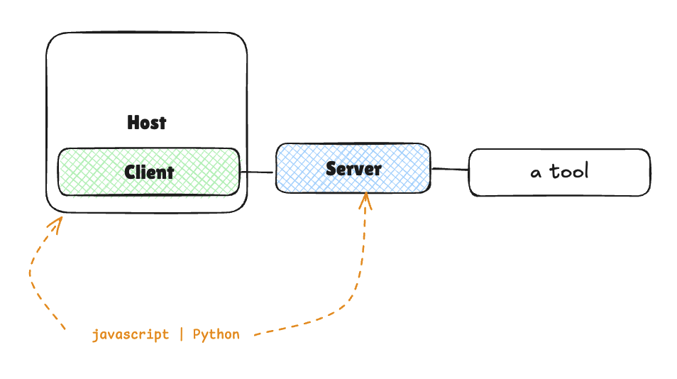
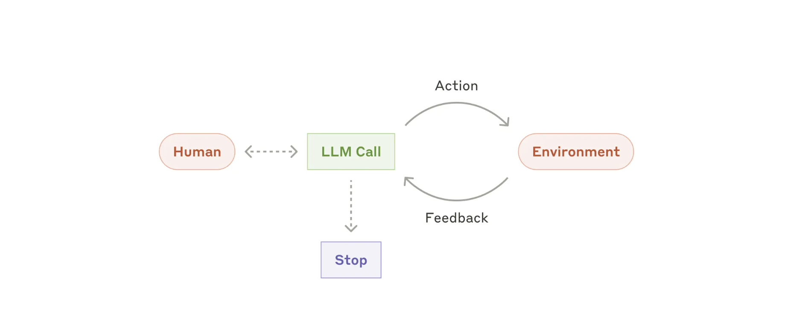
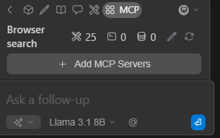
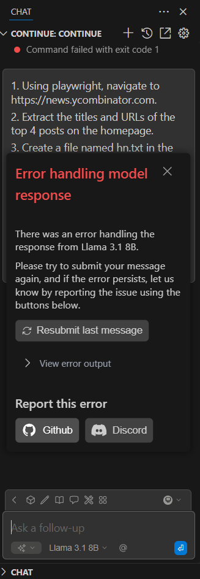
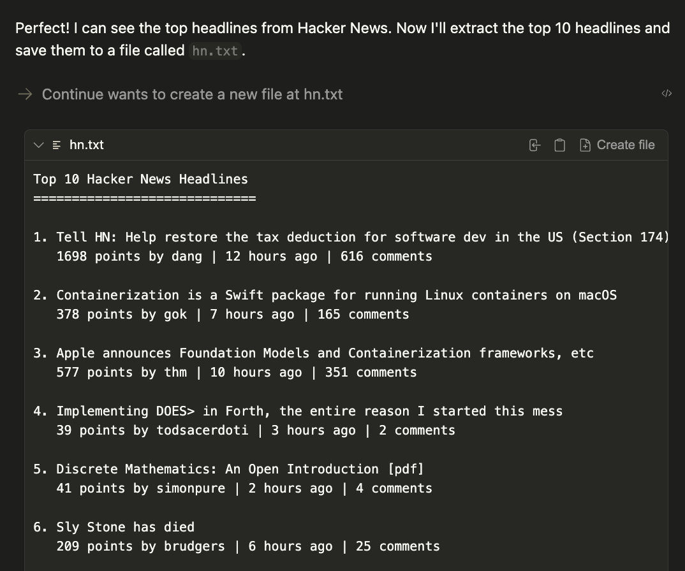

# [Model Context Protocol (MCP) - Second Unit](https://huggingface.co/learn/mcp-course/unit3/github-actions-integration#module-2-github-actions-integration)

Bu ünitede Gradio ve Hugging Face Hub kullanılarak basit bir MCP Server oluşturulacak. Hem Python hem de JavaScript/TypeScript dillerinden birinde hakim olmak öneriliyor. Temel API ve Client-Server mimarisi bilmek gerekiyor. Python ve Node.js geliştirme ortamları olması gerekiyor.

### [Our End-to-End Project](https://huggingface.co/learn/mcp-course/unit2/introduction#our-end-to-end-project)

Üç ana bölümden (server, client, deployment) oluşan duygu analizi yapan uygulama oluşturulacak.  

  

### [Server Side](https://huggingface.co/learn/mcp-course/unit2/introduction#server-side)
Web arayüzü oluşturmak için Gradio içinde `gr.Interface` sınıfı kullanılacak. TextBlob kullanılarak duygu analizi aracı geliştirilecek. Hem HTTP hem de MCP protokolleri iş görecek.  

### [Client Side](https://huggingface.co/learn/mcp-course/unit2/introduction#client-side)
HuggingFace.js client  veya smolagents Python Client oluşturulacak. Aynı sunucunun farklı istemci uygulamalarıyla nasıl çalıştırılabileceğini / entegre edilebileceğini gösterilecek.  

### [Deployment](http://huggingface.co/learn/mcp-course/unit2/introduction#deployment)
Server Hugging Face Spaces üzerinden deploy (dağıtılacak). Client tarafı deploy edilmiş sunucuyla çalışacak şekilde yapılandırır.  

# [Building the Gradio MCP Server](https://huggingface.co/learn/mcp-course/unit2/gradio-server#building-the-gradio-mcp-server)  

## [Introduction to Gradio MCP Integration](https://huggingface.co/learn/mcp-course/unit2/gradio-server#introduction-to-gradio-mcp-integration)
[launch(mcp_server=True)](../1/Sözlük/launch(mcp_server=True).md)  

## [Setting Up the Project](https://huggingface.co/learn/mcp-course/unit2/gradio-server#setting-up-the-project)
Öncelikle proje ortamı oluşturuluyor: Klasör açıldı, environment oluşturuldu, aktif edildi, gerekli kütüphaneler indirildi:
```Bash
mkdir mcp-sentiment
cd mcp-sentiment
python -m venv venv
source venv/bin/activate  # On Windows: venv\Scripts\activate
pip install "gradio[mcp]" textblob
```
## [Creating the Server](https://huggingface.co/learn/mcp-course/unit2/gradio-server#creating-the-server)
Klasör içinde app.py dosyası açılıyor. 
``` Python
import json
import gradio as gr
from textblob import TextBlob

def sentiment_analysis(text: str) -> str:
    """
    Analyze the sentiment of the given text.

    Args:
        text (str): The text to analyze

    Returns:
        str: A JSON string containing polarity, subjectivity, and assessment
    """
    blob = TextBlob(text)
    sentiment = blob.sentiment
    
    result = {
        "polarity": round(sentiment.polarity, 2),  # -1 (negative) to 1 (positive)
        "subjectivity": round(sentiment.subjectivity, 2),  # 0 (objective) to 1 (subjective)
        "assessment": "positive" if sentiment.polarity > 0 else "negative" if sentiment.polarity < 0 else "neutral"
    }

    return json.dumps(result)

# Create the Gradio interface
demo = gr.Interface(
    fn=sentiment_analysis,
    inputs=gr.Textbox(placeholder="Enter text to analyze..."),
    outputs=gr.Textbox(),  # Changed from gr.JSON() to gr.Textbox()
    title="Text Sentiment Analysis",
    description="Analyze the sentiment of text using TextBlob"
)

# Launch the interface and MCP server
if __name__ == "__main__":
    demo.launch(mcp_server=True)
```
JSON->Sonuçları JSON formatında döndürmek için.
gradio->Web arayüzü oluşturmak için.
TextBlob->Metinlerin duygu analizini yapmayı sağlar.
	`sentiment_analysis` Fonksiyonu verilen metnin duygu analizini yapar. MCP'nin aracı şemasını oluşturması için docstring içindeki ifadeler önemli. Tip ipuçları ile olması gereken girdi ve çıktı bilinebilir. Önce `TextBlob(text)` sınıfından bir nesne oluşturuluyor. Oluşturulan nesne ile `blob.sentiment` ile metnin duygusal özellikleri hesaplanır. Sonuç kısmında 3 değerli bir sözlük oluşturuluyor. polarity->-1(tamamen negatif), 0(nötr), 1(tamamen pozitif) / Yuvarlanmış değer alınıyor.
	subjectivity->0(tamamen nesnel), 1(tamamen öznel)
	assessment kısmında polarity>0 ise pozitif, polarity<0 ise negatif, diğer durumda nötr olarak değer çıkar. result python sözlüğünü JSON formatına çevirir ve döndürür.
gr.Interface ile demo adında hem web arayüzü hem de MCP Server oluşturuluyor. 
fn->arayüzde metin girdisi olunca çalışacak kod veriliyor.
inputs->Kullanıcıdan alınacak girdi tipini belirliyor. Girdi alanı açıyor.
outputs->Sonuçları gösterecek output alanı oluşturuluyor.
title->Web sayfasının başlığını belirler.
description->Uygulamanın ne yaptığını açıklayan metindir.
`demo.launch(mcp_server=True)`->web arayüzü çalıştırılıyor.
Server http://localhost:7860/gradio_api/mcp/sse adresinde çalışıyor. Gradio uygulamasını MCP sunucusu modunda çalıştırmak için:
```Bash
export GRADIO_MCP_SERVER=True
```
## [Running the Server](https://huggingface.co/learn/mcp-course/unit2/gradio-server#running-the-server)
```Bash
python app.py
```
Komutu ile Server çalıştırılır. Çıktıda hem MCP sunucusunun çalıştığı bilgisi hem de lokal Host adresi görünecek. Web arayüzü `http://localhost:7860` adresinde MCP sunucusu `http://localhost:7860/gradio_api/mcp/sse` adresinde olacak.
## [Testing the Server](https://huggingface.co/learn/mcp-course/unit2/gradio-server#testing-the-server)
**Web Interface**:
Web arayüzün doğru çalıştığını görmek için belirtilen adrese gidilir. İstenilen girdi verilir. Sonuç beklentiyi karşılamalı.
**MCP Schema**:
MCP şema ile sistemin hangi MCP araçlarına erişimi olduğu görülebilir. Bunu görmek için `http://localhost:7860/gradio_api/mcp/schema` adresine gidilmelidir.
## [Troubleshooting Tips](https://huggingface.co/learn/mcp-course/unit2/gradio-server#troubleshooting-tips)
1. **Type Hints (Tip ipuçları) and Docstrings (""" x """)**:
Fonksiyonun aldığı ve döndürdüğü değişkenler için tip belirtilmesi önerilir. Docstring içerisinde Args isimli bir blok içerisinde bu değişkenler açıklanmalı.
2. **String Inputs**:
Parametreler string olarak kabul edilebilir. Gerektiği takdirde fonksiyon içerisinde tip değişikliği yapılır.
3. **SSE Support**:
Bazı MCP istemcileri SSE tabanlı MCP sunucularını desteklemez. Bu durumda args içerisinde mcp-remote kullanılır. Örnek olarak:
```JSON
{
  "mcpServers": {
    "gradio": {
      "command": "npx",
      "args": [
        "mcp-remote",
        "http://localhost:7860/gradio_api/mcp/sse"
      ]
    }
  }
}
```
4-**Connection Issues**:
Bağlantı sorunları olursa hem istemci hem sunucuları tekrar başlatman önerilir. Server ve MCP schema gibi önemli bileşenler kontrol edilir.
## [Deploying to Hugging Face Spaces](https://huggingface.co/learn/mcp-course/unit2/gradio-server#deploying-to-hugging-face-spaces)
Diğer kullanıcıların sistemi kullanması için hugging face space üzerinde deploy gerçekleştirilebilir. Space açıldıktan sonra requirements.txt hazırlanır. Ardından kodlar Space kısmına gönderilir:
```Bash
git init
git add app.py requirements.txt
git commit -m "Initial commit"
git remote add origin https://huggingface.co/spaces/YOUR_USERNAME/mcp-sentiment
git push -u origin main
```
https://YOUR_USERNAME-mcp-sentiment.hf.space/gradio_api/mcp/sse Bu adreste MCP server görünür olacak.
# [Building MCP Clients](https://huggingface.co/learn/mcp-course/unit2/clients#building-mcp-clients)
Bu bölümde hem JavaScript (HuggingFace.js) hem de Python (smolagents) ile istemci oluşturulacak.
## [Configuring MCP Clients](https://huggingface.co/learn/mcp-course/unit2/clients#configuring-mcp-clients)
### [MCP Configuration Files](https://huggingface.co/learn/mcp-course/unit2/clients#mcp-configuration-files)
Tekrar mcp.json anlatılıyor. MCP host konfigürasyon dosyaları ile server bağlantısını yönetiyor. Standart konfigürasyon dosyaları mcp.json adında oluyor. Bu kısmı önceki bölümde gördüğüm için hızlı geçtim. Aşağıda lokalde çalışan sse taşıma tipi ile oluşturulan bir sunucu var. Port 7860 üzerinde çalışır.:
```JSON
{
  "servers": [
    {
      "name": "MCP Server",
      "transport": {
        "type": "sse",
        "url": "http://localhost:7860/gradio_api/mcp/sse"
      }
    }
  ]
}
```
Bir sonraki örnekte ise uzaktaki server bağlantısı gerçekleştiriliyor. HTTP+SSE taşıma şekli ile aşağıdaki mcp.json oluşturulmuş:
```JSON
{
  "servers": [
    {
      "name": "Remote MCP Server",
      "transport": {
        "type": "sse",
        "url": "https://example.com/gradio_api/mcp/sse"
      }
    }
  ]
}
```
## [Configuring a UI MCP Client](https://huggingface.co/learn/mcp-course/unit2/clients#configuring-a-ui-mcp-client)
MCP sunucusu ile UI istemcisi arasındaki bağlantı kurulumu açıklanıyor. Temel `config.json` verilmiş. 
```JSON
{
  "mcpServers": {
    "mcp": {
      "url": "http://localhost:7860/gradio_api/mcp/sse"
    }
  }
}
```
MCP sunucusu başlatıldığında, başka bir UI Client bu sunucuyla konuşabilmesi için nerede olduğunu bilmeli. Konfigürasyon bu yüzden var. Konum bilgisi sağlıyor.
## [Configuring an MCP Client within Cursor IDE](https://huggingface.co/learn/mcp-course/unit2/clients#configuring-an-mcp-client-within-cursor-ide)
Cursor IDE, MCP sunucusuna bağlanabilir. Bunu yapmak için:
Cursor ayarları üzerinden Tools & Integrations -> MCP Tolls üzerinden yeni MCP server eklenebilir.
Açılan JSON dosyasına macOS için:
``` JSON
{
  "mcpServers": {
    "sentiment-analysis": {
      "command": "npx",
      "args": [
        "-y", 
        "mcp-remote", 
        "https://YOURUSENAME-mcp-sentiment.hf.space/gradio_api/mcp/sse", 
        "--transport", 
        "sse-only"
      ]
    }
  }
}
```
Windows için:
```JSON
{
  "mcpServers": {
    "sentiment-analysis": {
      "command": "npx",
      "args": [
        "-y", 
        "mcp-remote", 
        "https://YOURUSENAME-mcp-sentiment.hf.space/gradio_api/mcp/sse", 
        "--transport", 
        "sse-only"
      ]
    }
  }
}
```
Girilir kaydedilir.
JSON dosyalarında mcp-remote kullanılma nedeni Cursor dahil çoğu MCP istemcisi sadece stdio desteği sağlıyor. mcp-remote aradaki köprü ve tercüman oluyor:
1. Cursor IDE -> mcp-remote arasında konuşur.
2. mcp-remote bu mesajı uzak sunucuya gönderir.
3. Uzak sunucu mcp-remote'a cevabı gönderir.
4. mcp-remote cevabı cursor'a iletir.
Bu yapılandırma ile Cursor yukarıdaki işlemleri yerine getirip sentiment analizi yapabilir.
# [Using MCP with Local and Open Source Models](https://huggingface.co/learn/mcp-course/unit2/continue-client#using-mcp-with-local-and-open-source-models)
`Continue`, açık kaynaklı bir AI coding assistant. Avantajı lokalde çalışan model ile entegre oluyor. VS code extensions kısmından bu araç indirilebilir.
### [Local Models](https://huggingface.co/learn/mcp-course/unit2/continue-client#local-models)
Lokalde model çalıştırmak için 3 popüler yöntem var: Ollama, Llama.cpp, LM Studio. Ollama açık kaynaklı ve kullanıcı dostu bir yöntem sunuyor. Llama.cpp yüksek performans sağlayan C++ kütüphanesi ve OpenAI uyumludur. LM Studio grafik arayüz sağlar. Devamında 3 yöntem de anlatılmış ama ben sadece Ollama kullanacağım.
Ollama kullanmak için önce [indirilmesi](https://ollama.com/download) gerekiyor. Ardından istenilen model indirilip kullanılabilir. Örneğin Devstral-Small modelini kullanmak için (cmd üzerinden):
```Bash
ollama run unsloth/devstral-small-2505-gguf:Q4_K_M
```
Continue ile çalışacak modelin tool-calling (araç çağırısı) yapabilmesi gerekir. Codestral, Qwen, Llama 3.1x gibi modeller kullanılabilir. Önerilen çalışma şekli:
1. Projenin en üst seviyesinde `.continue/models` klasörü oluşturulur.
2. Bu klasör içine `local-models.yaml` dosyası eklenir (isim önemsiz). `ollama.yaml` da olabilir.
3. İlgili konfigürasyon bilgileri bu dosya ile belirtilir. Ollama ile devstral modeli için:
```YAML
name: Ollama Devstral model
version: 0.0.1
schema: v1
models:
  - provider: ollama
    model: unsloth/devstral-small-2505-gguf:Q4_K_M
    defaultCompletionOptions:
      contextLength: 8192
    name: Ollama Devstral-Small
    roles:
      - chat
      - edit
```
Modellerin varsayılan olarak 128000 token sınırı var. Bu değiştirilebilir.
## [How it works](https://huggingface.co/learn/mcp-course/unit2/continue-client?local-models=ollama#how-it-works)
Bu sistemin çalışmasında önemli bir rolü araç çağrıları üstleniyor. Bundan dolayı yukarıda modelin tool-calling yapabilmesi gerektiğini belirttim. Araçlar modelin dış dünyaya erişmesini sağlar. Bu araçlar bir JSON nesnesi içerisinde verilir. Örneğin filepath argümanı içeren bir read_file aracı, modele bir dosyanın içeriğine erişme imkanı sağlar:
```JSON
{
  "name": "read_file",
  "arguments": {
    "filepath": {
      "type": "string",
      "description": "The path to the file you want to read"
    }
  }
}
```

Yukarıda LLM'in Agent gibi davranıp araçları nasıl kullandığı açıklanıyor:
1. Kullanıcı chat aracılığıyla bir istekte bulunur. AI'ya mevcut araçlar (JSON formatında) gösterilir.
2. AI gerek görürse bir araç çağrısı yapabilir. Yanıt içerisinde tool_call belirtilebilir.
3. Kullanıcı izin verir. Eğer otomatik izin verilecek şekilde ayarlanmışsa bu adım atlanır.
4. İlgili tool yerelde ise doğrudan çalıştırılır. Eğer tool mcp server'da ise server'a gönderilir.
5. Tool sonucu modele gönderilir.
6. Model sonuç ile kendini cevap vermeye hazır hissederse cevap kullanıcıya iletilir. Süreç sonlanır. Eğer model yapılan işlemleri ve verilecek sonucu beğenmezse sistem adım 2'den devam eder.
- Continue içerisinde çeşitli yerel modeller desteklenir. 
### [Local Model Integration with MCP](https://huggingface.co/learn/mcp-course/unit2/continue-client?local-models=ollama#local-model-integration-with-mcp)
Yerel model ile nasıl MCP server entegrasyonu yapılacağı açıklanıyor. Aşağıda önce klasör mimarisi hem de adım adım açıklamalar yer alıyor:
1. .continue->Continue AI Agent'ın ayar klasörü. mcpserver içerisinde ise sunucular tanımlanıyor. Yapılması gereken bu klasörün oluşturulması. workspace'in en üstünde olmalı.  
```plaintext
workspace/
├── .continue/
│   └── mcpServers/     ← Bu klasörü oluşturun
├── src/
├── package.json
└── ...
```
2. Oluşturulan bu klasör içinde `playwright-mcp.yaml` dosyası oluşturulur.
3. Aşağıdaki içerik yaml dosyasına yazılır. Kaydedilir.
```Yaml
name: Playwright mcpServer
version: 0.0.1
schema: v1
mcpServers:
  - name: Browser search
    command: npx
    args:
      - "@playwright/mcp@latest"
```
MCP kısmında Browser search aşağıdaki gibi çıkıyor:

Aşağıdaki prompt girildiğinde
```txt
1. Using playwright, navigate to https://news.ycombinator.com.

2. Extract the titles and URLs of the top 4 posts on the homepage.

3. Create a file named hn.txt in the root directory of the project.

4. Save this list as plain text in the hn.txt file, with each line containing the title and URL separated by a hyphen.

Do not output code or instructions—just complete the task and confirm when it is done.
```
aşağıdaki hata çıktı. Sadece 1 denememde hn.txt oluşturulabildi ama dosya içine bilgiler yazılamadı Sorunun ne olduğunu anlamadım. Sonrasında MCP Inspector ile denedim aşağıdaki hata devam etti.

Normalde alınması gereken çıktı aşağıdaki gibiymiş:

# [Gradio as an MCP Client](https://huggingface.co/learn/mcp-course/unit2/gradio-client#gradio-as-an-mcp-client)
Önceki bölümde oluşturulan MCP server'a yeni özellikler eklenecek.
## [MCP Client in Gradio](https://huggingface.co/learn/mcp-course/unit2/gradio-client#mcp-client-in-gradio)
### [Connect to an example MCP Server](https://huggingface.co/learn/mcp-course/unit2/gradio-client#connect-to-an-example-mcp-server)
Hugging Face space olarak çalışan [MCP sunucusuna](https://huggingface.co/spaces/abidlabs/mcp-tool-http/tree/main) bağlanılacak:
Eğer indirilmemişse `smolagents[mcp]` kütüphanesi indirilmeli
```Python
from smolagents.mcp_client import MCPClient

with MCPClient(
    {"url": "https://abidlabs-mcp-tool-http.hf.space/gradio_api/mcp/sse"}
) as tools:
    # Tools from the remote server are available
    print("\n".join(f"{t.name}: {t.description}" for t in tools))
```
	smolagents'ın mcp_client modülü içerisinden MCPClient sınıfı içe
	aktarılmış. MCPClient->MCP protokolü ile sunucuya bağlanmayı sağlar.
	with .. as .. (context manager) ile bağlantı açılır. 
	Son satırdaki her bir t->tool nesnesi olmak üzere aracın adını ve
	açıklamasını arka arkaya yazdırıyor.
Aşağıda olması gereken çıktı var.
```
prime_factors: Compute the prime factorization of a positive integer.
generate_cheetah_image: Generate a cheetah image.
image_orientation: Returns whether image is portrait or landscape.
sepia: Apply a sepia filter to the input image.
```
### [Connect to the MCP Server from Gradio](https://huggingface.co/learn/mcp-course/unit2/gradio-client#connect-to-the-mcp-server-from-gradio)
Yukarıda MCP server bağlantısı kuruldu. Bu sunucunun kullanılması lazım. Bunu yapabilmek için gerekli kütüphaneler indirilmeli:
```Bash 
pip install "smolagents[mcp]" "gradio[mcp]" mcp fastmcp
``` 
```Python
import gradio as gr
import os

from mcp import StdioServerParameters
from smolagents import InferenceClientModel, CodeAgent, ToolCollection, MCPClient
```
- UI gradio ile oluşturulacaktı bundan dolayı import edilmiş.
- `os` ile token bilgisi .env üzerinden alınacak.
- `StdioServerParameters` sınıfı MCP ile ilgili sunucu parametrelerini yapılandırmak için kullanır. stdin/stdout ile iletişim kurulacak sunucu ayarları sağlar.
- Kalanlar smolagents kütüphanesinden sınıflar:
	- `InferenceClientModel:` Bir inference (çıkarım) sunucusuna model bağlanmasını sağlar
	- `CodeAgent:` Kod yazıp çalıştırabilen bir AI Agent sınıfıdır.
	- `ToolCollection:` Çeşitli araçları bir araya toplayan koleksiyon sınıfıdır.
	- `MCPClient:` MCP üzerinden iletişim kuran Client sınıfıdır.

```Python
mcp_client = MCPClient(
    {"url": "https://abidlabs-mcp-tool-http.hf.space/gradio_api/mcp/sse"} # This is the MCP Client we created in the previous section
)
tools = mcp_client.get_tools()
```
Tekrar `MCPClient` ile bağlantı sağlanıyor. Bu sefer bu bağlantı nesne (`mcp_client`) olarak atanıyor. Bu MCP Client'ın bağlı olduğu sunucudan araç listesi alınıyor.
Araçlar kullanıma hazır olduğu için basit bir Agent oluşturulabilir. Bu işlem için Hugging Face token .env içerisinde kayıtlı olmalı.
```Python
model = InferenceClientModel(token=os.getenv("HF_TOKEN"))
agent = CodeAgent(tools=[*tools], model=model)
```
İlk satırda API üzerinden LLM bağlantısı kuruluyor.
Altında bir code agent oluşturuluyor. MCP Client'tan alınan araçlar bu agent'a veriliyor.
Devamında Gradio arayüzü tanımlanıyor:
```Python
demo = gr.ChatInterface(
    fn=lambda message, history: str(agent.run(message)),
    type="messages",
    examples=["Prime factorization of 68"],
    title="Agent with MCP Tools",
    description="This is a simple agent that uses MCP tools to answer questions."
)

demo.launch()
```
Kod blokları uygun şekilde bir araya getirilirse:
```Python
import gradio as gr
import os

from smolagents import InferenceClientModel, CodeAgent, MCPClient


try:
    mcp_client = MCPClient(
        {"url": "https://abidlabs-mcp-tool-http.hf.space/gradio_api/mcp/sse"}
    )
    tools = mcp_client.get_tools()

    model = InferenceClientModel(token=os.getenv("HUGGINGFACE_API_TOKEN"))
    agent = CodeAgent(tools=[*tools], model=model, additional_authorized_imports=["json", "ast", "urllib", "base64"])

    demo = gr.ChatInterface(
        fn=lambda message, history: str(agent.run(message)),
        type="messages",
        examples=["Analyze the sentiment of the following text 'This is awesome'"],
        title="Agent with MCP Tools",
        description="This is a simple agent that uses MCP tools to answer questions.",
    )

    demo.launch()
finally:
    mcp_client.disconnect()
```
## [Deploying to Hugging Face Spaces](https://huggingface.co/learn/mcp-course/unit2/gradio-client#deploying-to-hugging-face-spaces)
Server'ın dağıtımı kısmı Hugging Face Spaces üzerinden yapılıyor. Bu kısmı daha önce not almıştım.
# [Building Tiny Agents with MCP and the Hugging Face Hub](https://huggingface.co/learn/mcp-course/unit2/tiny-agents#building-tiny-agents-with-mcp-and-the-hugging-face-hub)
Tiny Agents, MCP server üzerinden gelen araçları LLM'lere bağlamak için basit bir yol sunar. Bu işi hem JavaScript hem de Python ile gerçekleştirebiliyor. Oluşturulan duygu analizi sunucusu gibi sayısız MCP sunucusu ile iletişim kurabilen bu yapı kullanılacak. MCP Client'ı üzerine sadece bir while loop ekleyerek agent oluşturur.

## [Installation](https://huggingface.co/learn/mcp-course/unit2/tiny-agents?tiny-agents=python#installation)
	Bazı MCP Client'lar SSE desteklemediği için Bu durumda [mcp-remote](https://github.com/geelen/mcp-remote) kullanılabilir. Bunu yapmak için önce Node.js indirilir. Ardından MCP Client yapılandırmasına aşağıdaki eklenir:
Önceki bölümlerde npm ve npx indirmiştim. Bunlara ek olarak mcp-remote indirilmeli:
```Bash
npm i mcp-remote
```
Hugging Face Hub, MCP desteği ile birlikte indirilmeli. Bunu da önceki bölümde yaptım.
## [Tiny Agents MCP Client in the Command Line](https://huggingface.co/learn/mcp-course/unit2/tiny-agents?tiny-agents=python#tiny-agents-mcp-client-in-the-command-line)
Önceki bölümde 
### [Connecting to MCP Servers](https://huggingface.co/learn/mcp-course/unit1/mcp-clients#connecting-to-mcp-servers)
kısmında yapılan işlemler tekrarlanıyor. Agent çalıştırılıyor. Bu oluşturulmuş sistem artık Gradio MCP sunucusuna bağlanabilen temel bir Tiny Agent. İçerisinde bir model, provider ve sunucu yapılandırması içeriyor. Aşağıdaki gibi lokalde çalışan açık kaynak bir model kullanılabilir:
```JSON
{
	"model": "Qwen/Qwen3-32B",
	"endpointUrl": "http://localhost:1234/v1",
	"servers": [
		{
			"type": "stdio",
			"config": {
				"command": "npx",
				"args": [
					"mcp-remote",
					"http://localhost:1234/v1/mcp/sse"
				]
			}
		}
	]
}
```
## [Custom Tiny Agents MCP Client](https://huggingface.co/learn/mcp-course/unit2/tiny-agents?tiny-agents=python#custom-tiny-agents-mcp-client)
### [Using the Gradio Server with Tiny Agents](https://huggingface.co/learn/mcp-course/unit2/tiny-agents?tiny-agents=python#using-the-gradio-server-with-tiny-agents)
```Python
import os

from huggingface_hub import Agent

agent = Agent(
    model="Qwen/Qwen2.5-72B-Instruct",
    provider="nebius",
    servers=[
        {
            "command": "npx",
            "args": [
                "mcp-remote",
                "http://localhost:7860/gradio_api/mcp/sse"  # Your Gradio MCP server
            ]
        }
    ],
)
```
Oluşturulan tiny Agent'a Gradio duygu analizi sunucusunun bağlanması için servers parametresi içine yazılması yeterlidir. Yukarı bu işlem gerçekleştiriliyor. List içinde server'a ait sözlük var. Sözlükte server'ın Node.js komutu çalıştıracağı ve aldığı argümanları (liste içinde) belirtiyor. mcp-remote (daha önce açıkladım) ile SSE desteği olmayan Client ile uzak sunucu bağlantısı yapıyor. Devamında sistemin lokalde Gradio MCP Server'ın SSE endpoint ile çalışacağı verilmiş. Bu sayede:
1. Dosya üzerinden okuma yapabilir.
2. Gradio server kullanarak duygu analizi yapabilir.
3. Sonuçlar bir dosyaya yazılıyor.
### [Deployment Considerations](https://huggingface.co/learn/mcp-course/unit2/tiny-agents?tiny-agents=python#deployment-considerations)
MCP server'ın dağıtımı (deployment) sürecinde Url kısmı değiştirilmeli:
```JSON
{
    command: "npx",
    args: [
        "mcp-remote",
        "https://YOUR_USERNAME-mcp-sentiment.hf.space/gradio_api/mcp/sse"
    ]
}
```
Bu sayede sistem lokalde değil. Space içerisinde çalışıyor.
## [Conclusion: Our Complete End-to-End MCP Application](https://huggingface.co/learn/mcp-course/unit2/tiny-agents?tiny-agents=python#conclusion-our-complete-end-to-end-mcp-application)
Yapılanlara kısa bir özet geçiyor.
