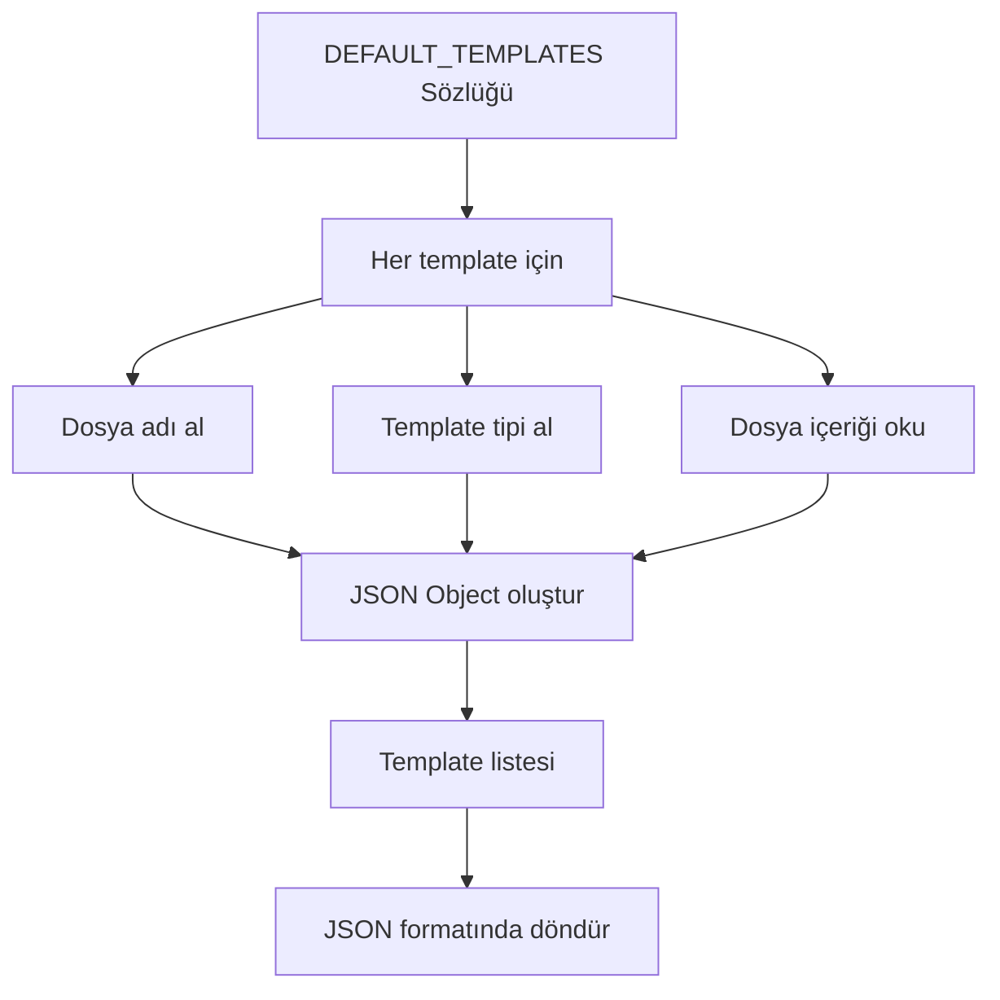
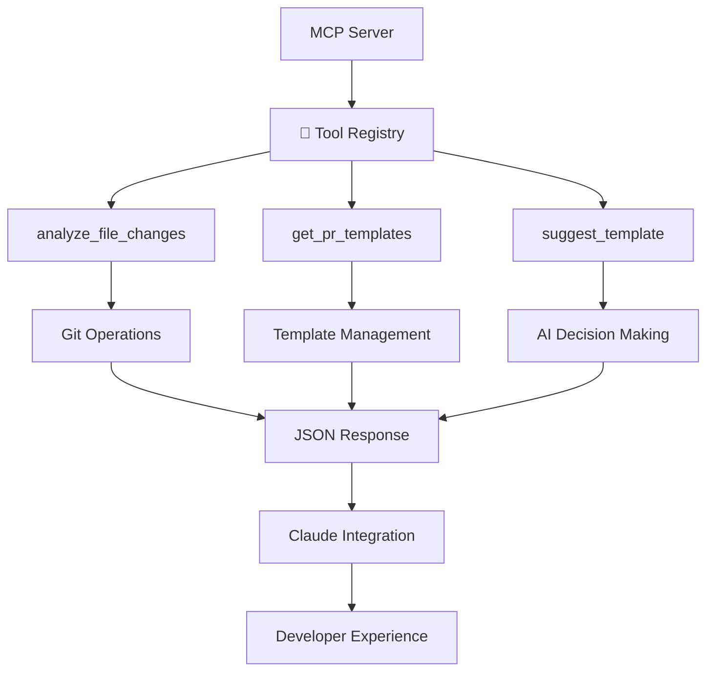

# MCP PR Chaos Çözümü: CodeCraft Studios Vakası  

CodeCraft Studios'da yaşanan PR kaosunu çözmek için geliştirilmiş Model Context Protocol (MCP) tabanlı bir çözüm. Bu proje, Hugging Face MCP kursunun 3. ünitesinden alınan notları içermektedir.  

**Amaç:** Git repository'lerinde dosya değişikliklerini analiz etmek ve uygun PR template'leri önermek için otomatik araçlar geliştirmek.  

## Core Fonksiyonlar  

### analyze_file_changes  

Git repository'sindeki dosya değişikliklerini kapsamlı bir şekilde analiz eden asenkron fonksiyon.  

#### Fonksiyon Tanımı  

```python
@mcp.tool()
async def analyze_file_changes(
    base_branch: str = "main",           # Karşılaştırma yapılacak ana branch
    include_diff: bool = True,           # Satır satır değişiklikler dahil edilsin mi?
    max_diff_lines: int = 500,           # Diff çıktısında maksimum 500 satır gösterilecek
    working_directory: Optional[str] = None  # Git komutlarının çalıştırılacağı dizin
) -> str:
```

#### Docstring ve Parametreler  

```python
"""Get the full diff and list of changed files in the current git repository.

Args:
    base_branch: Base branch to compare against (default: main)
    include_diff: Include the full diff content (default: true)
    max_diff_lines: Maximum number of diff lines to include (default: 500)
    working_directory: Directory to run git commands in (default: current directory)
"""
```

#### Hata Yönetimi  

Fonksiyon, güvenilir çalışma için kapsamlı hata yönetimi içerir:  

- **`subprocess.CalledProcessError`**: Git komutları başarısız olduğunda yakalar  
- **Genel Exception**: Beklenmeyen hata durumlarında `"error": str(e)` mesajı döner  

```python
try:
    # ... fonksiyonun tüm ana işlemleri burada ...
except subprocess.CalledProcessError as e:
    return json.dumps({"error": f"Git error: {e.stderr}"})
except Exception as e:
    return json.dumps({"error": str(e)})
```

#### Çalışma Dizini Belirleme  

Fonksiyon, MCP context'i kullanarak çalışma dizinini akıllıca belirler:  

```python
# MCP context'ten çalışma dizini alma
if working_directory is None:
    try:
        context = mcp.get_context()
        roots_result = await context.session.list_roots()
        # Claude Code ilk kök dizini CWD olarak ayarlar
        root = roots_result.roots[0]
        working_directory = root.uri.path
    except Exception:
        # Roots alınamazsa mevcut dizine geri dön
        pass
```

#### Debug Bilgileri  

Fonksiyon, sorun giderme için kapsamlı debug bilgileri toplar:  

```python
# Çalışma dizini belirleme
cwd = working_directory if working_directory else os.getcwd()

# Debug çıktısı
debug_info = {
    "provided_working_directory": working_directory,
    "actual_cwd": cwd,
    "server_process_cwd": os.getcwd(),
    "server_file_location": str(Path(__file__).parent),
    "roots_check": None
}
```

#### Git İşlemleri  

Fonksiyon, farklı Git komutlarını kullanarak kapsamlı analiz yapar:  

**1. Değişen Dosyaları Listele:**  

```python
# Dosya listesi ve durumları
files_result = subprocess.run(
    ["git", "diff", "--name-status", f"{base_branch}...HEAD"],
    capture_output=True,
    text=True,
    check=True,
    cwd=cwd
)
```

**2. Diff İstatistikleri:**  

```python
# Değişiklik istatistikleri
stat_result = subprocess.run(
    ["git", "diff", "--stat", f"{base_branch}...HEAD"],
    capture_output=True,
    text=True,
    cwd=cwd
)
```

**3. Detaylı Diff Çıktısı:**  

```python
# Satır satır değişiklikler
diff_content = ""
truncated = False
if include_diff:
    diff_result = subprocess.run(
        ["git", "diff", f"{base_branch}...HEAD"],
        capture_output=True,
        text=True,
        cwd=cwd
    )
    diff_lines = diff_result.stdout.split('\n')
    
    # Uzun çıktıları kırp
    if len(diff_lines) > max_diff_lines:
        diff_content = '\n'.join(diff_lines[:max_diff_lines])
        diff_content += f"\n\n... Output truncated. Showing {max_diff_lines} of {len(diff_lines)} lines ..."
        diff_content += "\n... Use max_diff_lines parameter to see more ..."
        truncated = True
    else:
        diff_content = diff_result.stdout
```

**4. Commit Mesajları:**  

```python
# Commit geçmişi
commits_result = subprocess.run(
    ["git", "log", "--oneline", f"{base_branch}..HEAD"],
    capture_output=True,
    text=True,
    cwd=cwd
)
```

#### Sonuç Dönüşü  

Tüm bilgiler JSON formatında döndürülür:  

```python
analysis = {
    "base_branch": base_branch,
    "files_changed": files_result.stdout,
    "statistics": stat_result.stdout,
    "commits": commits_result.stdout,
    "diff": diff_content if include_diff else "Diff not included (set include_diff=true to see full diff)",
    "truncated": truncated,
    "total_diff_lines": len(diff_lines) if include_diff else 0,
    "_debug": debug_info
}
return json.dumps(analysis, indent=2)
```
### get_pr_templates  

Sistemde tanımlı PR template'lerini çeken basit ama etkili bir fonksiyon.  

#### Fonksiyonun Amacı  

Bu fonksiyon, sistemde mevcut olan tüm PR template'lerini toplar ve JSON formatında döner. Bu sayede LLM, hangi template'lerin mevcut olduğunu anlayabilir.  

#### Fonksiyon Yapısı  

```python
@mcp.tool()
async def get_pr_templates() -> str:
    """List available PR templates with their content."""
    templates = [
        {
            "filename": filename,
            "type": template_type,
            "content": (TEMPLATES_DIR / filename).read_text()
        }
        for filename, template_type in DEFAULT_TEMPLATES.items()
    ]
    return json.dumps(templates, indent=2)
```

#### Veri Akışı  



#### Template Yapısı  

Her template şu bilgileri içerir:  

- **`filename`**: Template dosyasının adı  
- **`type`**: Template'in türü (feature, bugfix, docs, vb.)  
- **`content`**: Template'in tam içeriği  

#### Kullanım Senaryoları  

1. **Template Keşfi**: Mevcut template'leri listele  
2. **İçerik Analizi**: Template içeriklerini karşılaştır  
3. **Otomatik Seçim**: Değişiklik türüne göre uygun template'i bul  
## suggest_template
Yukarıda tanımlanan fonksiyonlar gibi fonksiyon tanımı yapılıyor. Bu aracın amacı PR şablonu önermek. Değişikliklerin özeti ve değişim tipi parametrelerini alıyor. Yukarıda tanımlanan get_pr_templates fonksiyonu kullanılarak mevcut şablonlar alınıyor. `json.loads()` metodu ile JSON, Python sözlüğüne çevrilir templates değişkenine atanır. TYPE_MAPPING fonksiyonları yazmadan tanımlanmış bir sözlük. Bu sözlük ile verilen change_type (değişim tipi) değerini uygun şablon dosya adına çevirir. Eşleşme yoksa `feature.md` kullanılır. selected_template ile eşleşen şablon liste üzerinden bir **generator** ile aranır. Eşleşme bulunamazsa `templates[0]` ilk şablon döndürülür. suggestion sözlüğü ile öneri nesnesi oluşturuluyor. Tüm bilgiler (önerilen şablon, neden önerildiği, şablonun tam içeriği, kullanıcıya Claude'un nasıl yardımcı olabileceği) bir araya getiriliyor. JSON formatına çevriliyor.
```Python
@mcp.tool()
async def suggest_template(changes_summary: str, change_type: str) -> str:
    """Let Claude analyze the changes and suggest the most appropriate PR template.
    Args:
        changes_summary: Your analysis of what the changes do
        change_type: The type of change you've identified (bug, feature, docs, refactor, test, etc.)
    """
    # Get available templates
    templates_response = await get_pr_templates()
    templates = json.loads(templates_response)
    # Find matching template
    template_file = TYPE_MAPPING.get(change_type.lower(), "feature.md")
    selected_template = next(
        (t for t in templates if t["filename"] == template_file),
        templates[0]  # Default to first template if no match
    )
    suggestion = {
        "recommended_template": selected_template,
        "reasoning": f"Based on your analysis: '{changes_summary}', this appears to be a {change_type} change.",
        "template_content": selected_template["content"],
        "usage_hint": "Claude can help you fill out this template based on the specific changes in your PR."    }
    return json.dumps(suggestion, indent=2)
```

---

### Test Kaynakları  

Kodun test edilmesi için Hugging Face MCP kursundaki adımları takip edebilirsiniz:  

> [Testing Your Implementation](https://huggingface.co/learn/mcp-course/unit3/build-mcp-server#testing-your-implementation)  

### Uygulama Mimarisi  



### Başarı Kriterleri  

- ✅ **Fonksiyonel Test**: Tüm fonksiyonlar beklendiği gibi çalışır  
- ✅ **Performans Test**: Hızlı response süreleri  
- ✅ **Hata Yönetimi**: Graceful error handling  
- ✅ **Entegrasyon Test**: MCP protokolü ile uyumlu  
- ✅ **Kullanıcı Deneyimi**: Sezgisel ve kullanışlı arayüz  

### Geliştirme Ortamı  

```bash
# Gereksinimler
pip install mcp-server
pip install asyncio
pip install json
pip install subprocess

# Test komutu
python -m pytest tests/
```
